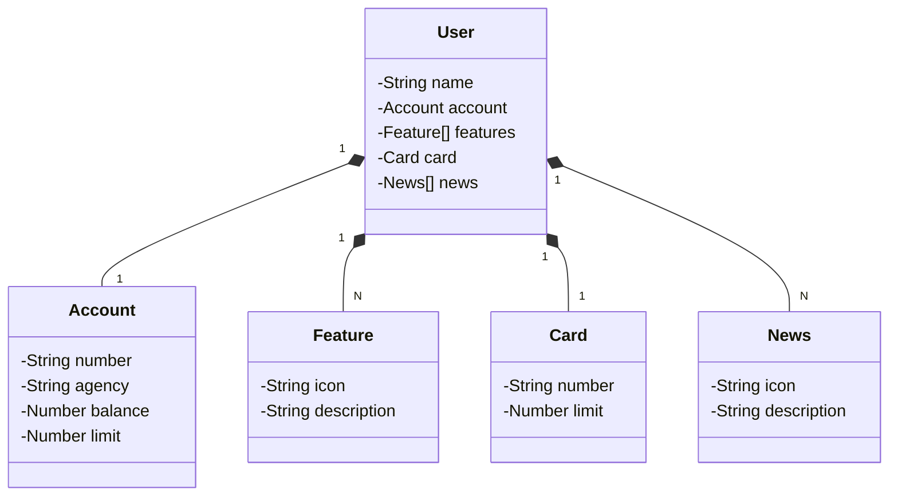

# Santander Bootcamp Week 2023 (Bootcamp DIO)  

## Descrição

Este projeto foi desenvolvido como parte do desafio do Santander Bootcamp 2023 - Fullstack Java + Angular. A API foi construída com o objetivo de demonstrar a utilização de tecnologias modernas, como Java 17, Spring Boot 3, OpenAPI (Swagger) e Railway para facilitar o deploy na nuvem e a comunicação com bancos de dados. O projeto se concentra em fornecer informações sobre contas, usuários, cartões e notícias.

## Principais Tecnologias

- **Java 17**: Utilizei o Java 17 para tirar proveito das funcionalidades modernas desta linguagem de programação.
- **Spring Boot 3**: Empreguei o Spring Boot 3 para maximizar a produtividade do desenvolvimento, aproveitando sua poderosa premissa de autoconfiguração.
- **Spring Data JPA**: Simplifiquei a integração com bancos de dados SQL e o acesso aos dados da aplicação usando Spring Data JPA.
- **OpenAPI (Swagger)**: Criei uma documentação de API eficaz e fácil de entender com o uso do Swagger, alinhando-se perfeitamente com a alta produtividade oferecida pelo Spring Boot.
- **Railway**: Facilitei o deploy e monitoramento na nuvem, além de aproveitar os serviços de banco de dados como um serviço e pipelines de CI/CD.

## Diagrama de Classes (Domínio da API)

A seguir, você encontrará um diagrama de classes que representa o domínio da API:



## Uso

Para executar a API localmente, siga estas etapas:

1. Clone o repositório:
```
git clone https://github.com/caioaugustolima/santander-dev-week.git
```

2. Navegue até o diretório raiz:
```
cd santander-dev-week
```

3. Execute o aplicativo:
   
```
./mvnw spring-boot:run
```
Agora, você pode acessar a documentação da API Swagger em  [http://localhost:8080/swagger-ui.html](http://localhost:8080/swagger-ui.html) para obter informações sobre os endpoints disponíveis.

Lembre-se de que o URL do repositório foi atualizado para "https://github.com/caioaugustolima/santander-dev-week.git".

## Implantação

Este projeto foi configurado para ser implantado no Railway. Você pode encontrar mais informações sobre como implantar a aplicação no [site do Railway](https://railway.app).

## Contribuições

Contribuições são bem-vindas! Sinta-se à vontade para abrir problemas e enviar solicitações pull.
